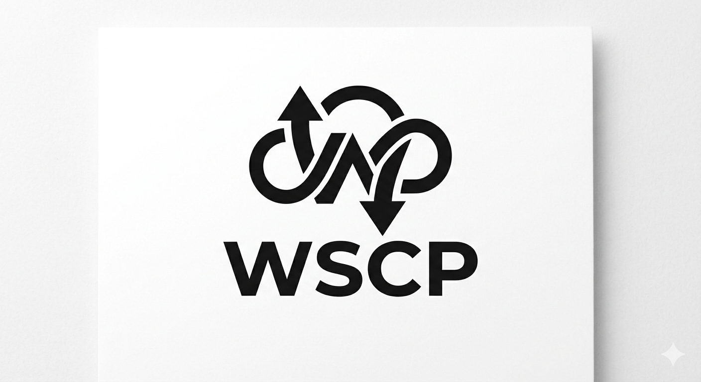

# WSCP




WSCP is a lightweight LAN file sharing server for quick transfer between devices (phone <-> PC, PC <-> PC).

## Backstory

The idea started as a simpler WinSCP-like tool for local sharing during writeups and daily file movement.
The media preview style (PDF, image, audio, video viewing) was inspired by Copy Party.

## Features

- Upload and download controls (upload-only, download-only, restricted download sets)
- File and folder management (create, rename, move, delete, bulk actions)
- Built-in previews: text, image, video, audio, PDF
- Single and bulk download with optional SHA-256 support
- Search, responsive web UI, and LAN-friendly sharing

## Run

```bash
python WSCP.py
```

Then:

1. Answer startup permission prompts.
2. Open the printed LAN URL in your browser.
3. Put files in `shared_files` to share immediately.
